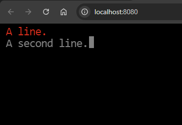

# vue-terminal-textbox
A component for Vue 3 that outputs text slowly like an old CRT terminal

Some instructions for making a component library are here: https://blog.logrocket.com/building-vue-3-component-library/

This is a component that looks like an old text terminal.  It prints out text slowly with a cursor.  The speed, color, and cursor type can be configured.

## Setup

For now, this is distributed a a .vue file.  This should be out into npm in the future.

1. Clone this repository.
1. Copy the `src/TerminalTextBox.vue` to your Vue 3 project's `src/components` folder.
1. Add a component to your page, either by the Vue app initialization or in the page itself:

`import TerminalTextBox from "../components/TerminalTextBox.vue";`

`Vue.component("TerminalTextBox", TerminalTextBox);`

# Use

The default slot (`<TerminalTextBox>text here</TerminalTextBox`) isn't used yet.  You write text incrementally like an old terminal.

1. Place the component in your page or template: `<TerminalTextbox ref="Terminal" />`
2. Reference the ref name in your Vue script, and call the `Write(Content, Color)` method on that ref: `this.$refs.Terminal.Write("A line.\n", "red");`

##  Attributes

`<TerminalTextBox ref="REFVARIABLE" content-class="CLASSNAME" speed="SPEEDNUMBER" character-size="SIZENUMBER" line-cursor />`

#### ref _(optional)_
This is the ref with which you use the control in a script.

#### content-class _(optional)_
This is a class string that appends to the internal classes used by the template inside the component.

#### speed _(optional)_
This is how fast the text is drawn.  The higher the number, the faster the output is.  The characters will be drawn one every `1000/SPEEDNUMBER` seconds.  The default is 10.

#### character-size _(optional)_
This is the height of the characters in pixels.  The width of each character is half of this value on most browsers.

#### line-cursor _(optional)_
If present, the cursor will be an underline.  Without this attribute, it's a block cursor.

## Methods

### Write(Content, Color)

#### Content
This string will be appended to the output.  It can contain `"\n"` to have a new line in the output.

#### Color _(optional)_
This is the color used for the content given.  It can be an HTML color, such as `"red"` or `"grey"`.  If omitted, then `"grey"` will be used.

